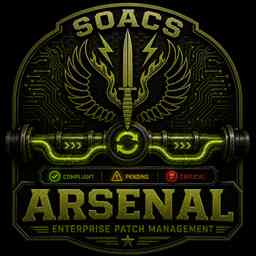

# SOACS Arsenal

<p align="center">
  
</p>

**Offline software and patch orchestration for disconnected Windows environments.**

SOACS Arsenal is a mission-focused Windows patch and software deployment application designed for environments where normal enterprise update infrastructure may be unavailable or intentionally disconnected. It scans an offline repository, identifies supported package types, validates package integrity, builds an ordered install plan, and can produce a self-contained deployment ZIP for transfer to target systems.

## Current baseline

- **Version:** 1.5.4 Alpha
- **Status:** Working Prototype / Alpha
- **Platform:** Windows
- **Application:** WPF desktop application
- **Framework:** .NET Framework 4.8
- **Build:** Visual Studio 2019, Any CPU
- **Deployment model:** Offline / disconnected

> The assembly metadata and v1.5.4 build notes identify 1.5.4 Alpha as the current source baseline. Some legacy UI text still displays v1.5.3 Alpha and should be normalized before a later release candidate.

## What Arsenal does

Arsenal is intended to reduce the manual effort involved in preparing and applying software and patch updates on disconnected Windows systems while keeping operator control over higher-risk actions.

### Repository scanning and planning

- Scans a selected offline update repository
- Identifies supported package types and metadata
- Categorizes packages and builds an ordered install plan
- Supports application rules for silent-install behavior
- Allows new executable rules to be taught through the application

### Package validation

- SHA-256 package qualification and verification
- Publisher, product, and file-version inspection
- Expected-versus-calculated hash visibility
- Deployment ZIP verification after package creation

### Installation support

The standalone deployment runner supports common Windows package formats including:

- `.msu`
- `.cab`
- `.msi`
- `.msp`
- `.appx` / `.appxbundle`
- `.msix` / `.msixbundle`
- Supported `.exe` installers through application rules

The deployment engine records completion, failure, manual-review, and reboot-required results and continues processing subsequent packages when an individual update fails.

### Firmware safeguards

Firmware and BIOS updates are intentionally guarded. Arsenal requires machine qualification and explicit operator approval before firmware execution is allowed in the standalone deployment workflow.

### Offline deployment package builder

Arsenal can create a portable deployment ZIP containing:

- PowerShell deployment runner
- Administrator launcher
- Ordered install plan
- `PatchManifest.xml`
- `SHA256SUMS.txt`
- Application rule catalog
- Required repository content
- Deployment instructions

The target workstation does **not** require the Arsenal GUI to be installed in order to run a generated standalone deployment package.

## v1.5.4 Alpha highlights

- Improved foreground/text visibility throughout the interface
- Deployment build progress bar and percentage
- Current phase and current-file visibility
- Copied-byte and file-count tracking
- Live deployment build log
- High-contrast package-content display
- Automatic deployment ZIP creation and verification
- Unique Deployment ID in manifests and completion summaries
- Automatic cleanup of temporary staging folders after ZIP verification

## Source layout

```text
SOACS-Arsenal/
├── Assets/                 Branding and application icon resources
├── Deployment/             Standalone PowerShell deployment runner
├── Models/                 Arsenal data models
├── Properties/             Assembly metadata
├── Services/               Scanning, validation, install, and deployment services
├── docs/                   Historical build notes
├── App.xaml
├── MainWindow.xaml
├── SOACS.Arsenal.csproj
└── SOACS.Arsenal.sln
```

## Building

1. Open `SOACS.Arsenal.sln` in Visual Studio 2019 or a compatible Visual Studio installation.
2. Select `Debug` or `Release` and `Any CPU`.
3. Build the solution.
4. The application output is written to `bin\Debug` or `bin\Release`.

No external NuGet dependency is required by the current project file.

## Branch workflow

- `main` — stable repository baseline
- `develop` — integrated development
- `feature/<description>` — isolated feature or fix work

Changes should flow from feature branches into `develop`, then from tested `develop` into `main` through a pull request.

## Repository safety

Do not commit operational patch repositories, generated deployment packages, logs, customer/site-specific data, credentials, machine-specific configuration, or other sensitive deployment artifacts to this repository.

## Release status

Arsenal is currently a **working prototype / Alpha**. It is functional software under active refinement and should not yet be represented as a production release.

---

**SOACS Arsenal — Offline patch orchestration for disconnected mission systems.**
